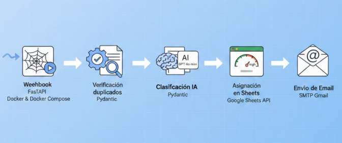
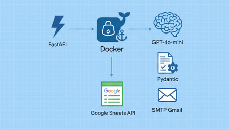

# Lead Automation System

Sistema backend desarrollado con FastAPI que automatiza el procesamiento inteligente de leads mediante un webhook.

El flujo valida datos, evita duplicados, clasifica el mensaje con Inteligencia Artificial, asigna prioridad, almacena la información y envía una notificación automática al usuario.

---

## 🎯 Objetivo

Construir un servicio backend capaz de:

    -   Recibir leads vía webhook
    -	Validar campos obligatorios
    -	Evitar registros duplicados
    -	Clasificar mensajes usando IA
    -	Asignar prioridad según reglas de negocio
    -	Persistir información
    -	Enviar respuesta automática por correo

---

## 🏗 Arquitectura

El proyecto sigue una estructura basada en separación de responsabilidades:

```bash
    app/
    ├── schemas/
    │   ├── models.py            # Modelos de validación
    ├── services/
    │   ├── ai_service.py        # Integración OpenAI
    │   ├── google_sheets.py     # Persistencia
    │   └── email_service.py     # Envío de correos
    ├── main.py                  # Capa HTTP (FastAPI)
```

---

### Flujo del sistema

```bash
    POST /leads
        ↓
    Validación con Pydantic
        ↓
    Verificación de duplicados
        ↓
    Clasificación con OpenAI
        ↓
    Asignación de prioridad
        ↓
    Persistencia en Google Sheets
        ↓
    Envío de correo automático
```



---

## 🛠 Tecnologías Utilizadas

- **FastAPI**
- **Python 3.11**
- **Pydantic**
- **Docker & Docker Compose**
- **OpenAI API (gpt-4o-mini)**
- **Google Sheets API (Service Account)**
- **SMTP Gmail**



---

## 🤖 Clasificación con Inteligencia Artificial

Se integra OpenAI para clasificar el mensaje en:

    -	Ventas
    -	Soporte
    -	Información
    -	Spam
    -	Generar un resumen automático del contenido

La integración está encapsulada en un servicio independiente para mantener desacoplada la capa HTTP.

---

## 📊 Reglas de Prioridad

```bash
│ Categoría     ──  Prioridad  │
│ Soporte       ──>    Alta    │
│ Ventas        ──>    Media   │
│ Información   ──>    Media   │
│ Spam          ──>    Baja    │
```

---

## 📦 Persistencia

Se utiliza Google Sheets como almacenamiento ligero para esta implementación:

    -	Autenticación mediante Service Account
    -	Credenciales protegidas mediante variables de entorno
    -	Verificación de duplicados por email

En un entorno productivo se recomienda migrar a una base de datos relacional con índice único en el campo email.

---

## 📧 Notificación Automática

El sistema envía un correo automático utilizando:

    -	Conexión segura SMTP_SSL
    -	Autenticación mediante App Password
    -	Manejo seguro de credenciales

---

## 🔐 Seguridad

    -	Variables de entorno para todas las credenciales
    -	No se almacenan secretos en el repositorio
    -	Scopes mínimos necesarios en Google API
    -	Aplicación contenerizada con Docker
    -	Separación clara entre capas

---

## 🐳 Ejecución con Docker

Construir la imagen:
```bash
    $ docker-compose up --build / en primer plano
    $ docker-compose up -d --build / en segundo plano
```

La API estará disponible en:
```bash
    http://localhost:8000
```

---

## 📥 Endpoint

POST /leads

Ejemplo de request:
```json
    {
        "name": "Juan Perez",
        "email": "juan@email.com",
        "message": "Necesito información urgente sobre sus servicios"
    }
```

---

## ⚙️ Variables de Entorno

Ejemplo .env:
```bash
    OPENAI_API_KEY=sk-xxxx
    EMAIL_USER=correo@gmail.com
    EMAIL_PASS=app_password
    GOOGLE_CREDENTIALS_JSON={"type":"service_account", ...}
```

---

## 🚀 Posibles Mejoras

    -	Migración a PostgreSQL
    -	Índice único en email
    -	Procesamiento asíncrono para clasificación IA
    -	Logging estructurado
    -	Tests automatizados
    -	Despliegue en entorno cloud

---

## 👨‍💻 Autor
```bash
    Gianmarco Linares
    Full Stack Developer
```